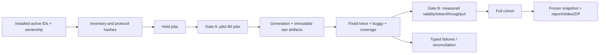

# ร่างรายงาน API854 — งานของออม

สถานะ: preparation checkpoint ยังไม่ใช่รายงานผลทดลองฉบับส่ง
แผนเริ่ม 3 ต.ค. 2569 05:00 และส่ง 5 ต.ค. 2569 05:00 ตาม Asia/Bangkok
การเตรียม tooling ไม่ใช่ T0 ของ actual run; run metadata ต้องใช้เวลาที่เริ่มรันจริง

## ขอบเขตและคำถามการวิจัย

เปรียบเทียบ CMA-ES, FSCS-ART, KKU Claude Haiku และ KKU Gemini Flash Lite
กับ 854 active bugs จาก 17 projects ใน installed Defects4J 3.0.1
RQ1: target-class line/condition coverage; RQ2: distinct faults detected;
RQ3: generation/evaluation cost, usable/failure rates และข้อจำกัดในการใช้งาน
หนึ่ง job ต่อ bug/วิธี รวม 3,416 keys; attempts และ test methods เป็นคนละหน่วย

## ระเบียบวิธี

ใช้ prospective eligibility/shared declarations และ fixed-reference oracle
Algorithms seed 101 / 30 proposals; AI รุ่น/settings ต้องตรึงหลัง resolve API mapping
Fixed ผ่านสองครั้ง suiteเดียวกันวัด buggy และ modified-class coverage
Source/API/build context คงขอบเขตเดียวกัน ไม่ส่ง failure logs กลับ KKU
Raw response immutable; local extraction/processing/repair เปิดเผยและแยก condition
ดู PROTOCOL_TH.md และ QUEUE_CONTRACT_TH.md สำหรับกติกาที่รอทีมรับรอง

## ผลที่ยืนยันใน checkpoint นี้

Installed IDs ตรง ownership 854 unique pairs ครบ 17 projects
Prospective jobs 3,416 unique keys: champ 1,140; beam 1,140; aom 1,136
ยังไม่มี primary experiment: attempted=0, terminal=0, usable=0, matched usable=0/854
ไม่ทำ fault/coverage/token/ETA inference จาก manifest; unknown metrics คง null
ตัวเลข snapshot และ hash ดู output/api854-20261003/preparation/REPORT_TH.md/progress.json
ผลเก่า 17 bugs/204 รอบคงเป็น historical appendix และไม่นับใน API854

## วิธีวิเคราะห์เมื่อมี observed results

รายงาน all-attempt failures/missing jobs และแยก matched cohort ที่ usableครบสี่วิธี
Coverage macro/micro แสดง denominator; faults นับ distinct project/bug pairs
Show generation/compile/fixed/evaluation eligibility พร้อม refusal/truncation/environment/coverage failures
Costs เป็น workflow wall time ที่รวม overhead ตาม timestamps ไม่ใช่ causal speed comparison
แยก model/protocol/processing conditions และ unknown API usage

## สิ่งที่ยังต้องทำตามข้อ 2.2

- รัน algorithms และ AI พร้อม evaluation ทุกรายการตามจริง; เก็บ partial เมื่อยังไม่ครบ
- เปรียบเทียบสี่วิธี สรุปสิ่งที่เรียนรู้และปัญหาจาก observed evidence
- ส่ง source/test code, prompts/configuration, raw results, diagrams และ reproduction instructions
- ทำรายงานฉบับส่งในรูปแบบที่ทีมเลือก พร้อม presentation และ demo จาก frozen snapshot เดียว
- README ระบุชื่อ-นามสกุล/รหัสสมาชิกจริงจากทีม; ห้ามเดา identities
- ทีมตรวจรับก่อนส่ง GitHub/Google Classroom; ไม่มีการส่ง Classroom จากการเตรียมนี้

ข้อกำหนดตรวจจาก `SQA_Project_2026 (2).pdf` หน้า 3 ข้อ 2.2
การครบ tooling/inventory ไม่ใช่การครบ assignment หรือ Gate A/B
