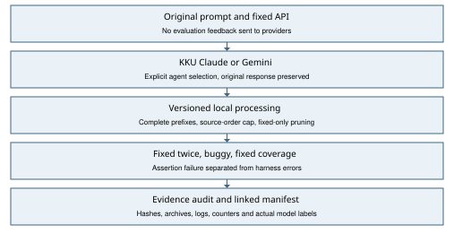
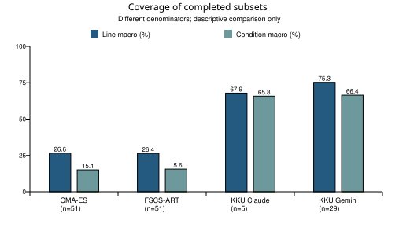

# การสร้างชุดทดสอบ Java: ผลรอบที่ 2

กลุ่ม 14 / CP353201 Software Quality Assurance

CMA-ES และ FSCS-ART เปรียบเทียบกับ Claude และ Gemini ผ่าน KKU IntelSphere

ข้อมูล ณ 2026-10-02T13:29:42.481413+00:00 UTC

## สถานะล่าสุดสำหรับส่งภายใน 23:00 วันที่ 2 ตุลาคม

ผลหลักเงื่อนไข prompt เดิม: 183/204 รอบ; CMA-ES และ FSCS-ART อย่างละ 51/51 รอบ และ Gemini 51/51 รอบ Claude ยังขาด 21 รอบ ไม่อ้างว่างานทดลองครบทั้งหมด

Claude ในผลหลักรวมหลายรุ่น: Haiku 25 รอบ ครอบคลุม 13/17 โปรเจกต์ และผล Sonnet เดิม 5 รอบ แยกชื่อรุ่นตาม manifest ไม่เรียกผล Sonnet ว่า Haiku หากใช้เงื่อนไข Haiku เท่านั้น ผลหลักที่ผ่านรวม 178/204 รอบ ตารางรวมตระกูล Claude ด้านล่างยังมี Sonnet จึงใช้เป็นผลประวัติและต้องอ่านการแยกรุ่นนี้ประกอบ

ผลเพิ่ม Time-1/101: คำชี้แจงบริบทตามรายวิชาที่ผู้ใช้อนุญาต เป็น prompt iteration 2 มี 30 เทส ผ่าน fixed ซ้ำ รัน buggy และ coverage ครบ ไม่พบ sampled fault; line 36/305, branch 9/122 เก็บใน kku-clarified-20261002 แยกจากผลหลัก ไม่บวกเป็นรอบอิสระของ prompt เดิม

ผลเพิ่มเติมผ่าน execution audit 1/1 รายการ JxPath-1/103 iteration 2 ได้คำตอบเชิงอธิบายแต่ไม่มี Java source จึง generation_failed และไม่มี coverage ที่อนุมานขึ้น

หน้า KKU ของบัญชีที่ผู้ใช้เปิดให้แสดง Claude Haiku quota 100% หลังคำตอบ JxPath ช่วง 20:17 น. ดูภาพและ request/operator metadata ที่ capture; ไม่คาดเดาเวลาที่โควต้ารีเซ็ต

JacksonXml-1/102 ซ่อมจากคำตอบ Haiku เดิมด้วย policy v84: import ของ Woodstox, cast ของ null overloads, helper catch ที่ compiler ไม่ยอมรับ, ตัดทั้งเมธอดที่ใช้ API ไม่มีในรุ่นนี้ และเลื่อน XML fixture ไป START_ELEMENT ตาม fixed setup failure ก่อนจำกัด 30 และ fixed-only pruning เหลือ 26 เทส Assertions ที่เก็บไว้ไม่เปลี่ยน คำตอบต้นฉบับมี 58 methods แต่ raw count ใน record เป็น 57 หลัง compatibility exclusion

JacksonDatabind-1/101 ใช้การซ่อม fixture/import แบบประกาศเวอร์ชันก่อนรันและเก็บ failed attempts v85-v88 ตาม fixed diagnostics ไม่ส่ง diagnostics ให้ AI ไม่เปลี่ยน assertions; ใช้สถานะใน manifest ล่าสุด ไม่อนุมานว่าทุกการซ่อมสำเร็จ

ภาพ PNG เพิ่ม 7 รายการเป็นการแปลงภาพ JPEG ต้นฉบับที่มีอยู่ให้ format ตรงกับ auditor โดยคง pixels และ JPEG เดิม ไม่ได้สร้างภาพหลักฐานย้อนหลัง ดู image-format-receipt.json

ชุดส่งคืนนี้จำกัด 17 บัค งานทดลอง Chart-1 ใหม่ในชุด bugs850 และแผน 850 บัคไม่รวมในตัวเลขของชุดนี้ และยังไม่ได้ส่ง Classroom

สถานะ: สำเร็จ 183/204 รอบตามแผนทีม งานทดลองยังไม่ครบ และยังไม่ใช่หลักฐานการส่ง Classroom

## ขอบเขตและการเปลี่ยนแผน

อ้างอิงเกณฑ์ SQA_Project_2026.pdf สำหรับการส่งรอบ 2: ใช้สองอัลกอริทึมและสองเครื่องมือ AI สร้าง unit tests ของ Java projects ใน Defects4J เปรียบเทียบ coverage, fault detection และ efficiency พร้อมโค้ด หลักฐาน รายงาน การนำเสนอและ demo

เจ้าของงานกำหนดให้ส่ง prompt ผ่าน https://gen.ai.kku.ac.th/chat เท่านั้น และเลือกเฉพาะ Claude กับ Gemini จึงใช้กลุ่มเปรียบเทียบใหม่ CMA-ES, FSCS-ART, KKU Claude และ KKU Gemini ผล Claude โดยตรงและโมเดลตระกูลอื่นในชุดเดิมไม่รวมในผลหลัก ไม่อ้างว่าผู้สอนอนุมัติการเปลี่ยนเครื่องมือจากแผนรอบแรก

17 projects × 1 active bug/project × 3 run indices (101/102/103) × 4 approaches = 204 รอบ งบสูงสุด 30 วิธีทดสอบต่อชุด AI ส่วนอัลกอริทึมเสนอ 30 input vectors จำนวนนี้เป็นแผนทีม ไม่ใช่จำนวนที่โจทย์ระบุโดยตรง หนึ่ง bug ต่อ project ไม่ครอบคลุมทุก bug ในฐานข้อมูล

โปรเจกต์: Chart, Cli, Closure, Codec, Collections, Compress, Csv, Gson, JacksonCore, JacksonDatabind, JacksonXml, Jsoup, JxPath, Lang, Math, Mockito, Time

## สถานะและจำนวนชุดทดสอบ

| วิธี | สำเร็จ/51 | โปรเจกต์/17 | Test methods | ใช้เดิม | ทำใหม่ | ขาด | ยังไม่สำเร็จ |
|---|---|---|---|---|---|---|---|
| CMA-ES | 51/51 | 17/17 | 1,529 | 51 | 0 | 0 | 0 |
| FSCS-ART | 51/51 | 17/17 | 1,529 | 51 | 0 | 0 | 0 |
| KKU Claude | 30/51 | 15/17 | 782 | 3 | 27 | 1 | 20 |
| KKU Gemini | 51/51 | 17/17 | 988 | 13 | 38 | 0 | 0 |

จำนวน methods เป็นผลรวม declared methods ใน completed suites อาจมีสถานการณ์ซ้ำข้ามรอบ ไม่ใช่ unique scenarios และไม่คูณจำนวนการรัน fixed/buggy ผล failed/missing มีค่าการวัดที่ไม่มีเป็น null ไม่แทนด้วยศูนย์

มี fresh completed records ที่ซ้ำ identity กับผลเดิม 1 รายการ: Time/Gemini/102 เก็บผลใหม่เป็น secondary validation และคงผลเดิมเป็น primary ตามลำดับที่มีหลักฐานก่อน โดยไม่ใช้ fault/coverage เลือกผล จึงไม่เพิ่มจำนวนรอบหรือ methods ในตาราง primary ตรวจผลที่สำเร็จด้วย audit แยกตาม family รวม secondary โดยอ่านจำนวนล่าสุดจาก claude/gemini-evidence-audit.json

ผลเดิมผ่าน baseline audit 171/171 records การนำมาใช้ในชุดนี้อ้าง record path และ SHA-256 ไม่แก้ชื่อโมเดลหรือ generator เดิม เลือกเฉพาะผลอัลกอริทึมและคำตอบ KKU ที่ระบุ resolved model เป็น Claude/Gemini และ metadata ตรงกัน ผล KKU เดิมบางรายการมาจาก Auto Router ซึ่งแยกจากคำตอบใหม่ที่เลือก agent โดยตรง

## วิธีสร้างอินพุตและ oracle

FSCS-ART เลือก candidate ที่มีระยะห่างต่ำสุดจากอินพุตก่อนหน้ามากที่สุดใน normalized input space ทำให้ชุดอินพุตกระจายตัว CMA-ES ปรับ mean, covariance และ step size ของการค้นหาตัวแปรต่อเนื่อง ตัว implementation ในงานนี้ใช้ความถี่ของ fixed behavior เป็น objective เพื่อเพิ่มความหลากหลายของ output ไม่ใช้ coverage เป็น fitness

SqaProbe ใช้ signatures ที่มีทั้ง fixed และ buggy revisions รวมสมาชิก non-public ที่ reflection เข้าถึงได้ สร้าง scalar, enum, string, array, collection และ constructor fixture แบบจำกัด ทุก proposed input สังเกต fixed สองครั้ง เก็บเฉพาะผลคงที่และ input ไม่ซ้ำมาสร้าง assertions ผล opaque object ยืนยันได้เพียง runtime type ส่วน serialized output ยาวเกิน 16000 ตัวอักษรใช้ SHA-256 และ byte length ข้อจำกัดนี้ลดการทดสอบ object graphs และ stateful sequences

AI ใช้ prompt ต้นฉบับของแต่ละ project ใน ai-context/prompt.md ให้ fixed source/build/API context ใช้ prompt เดิมในแชทใหม่ต่อ attempt โดยคง run index ไม่ส่ง compile/error/coverage/buggy logs กลับให้ AI โค้ดจากส่วน thinking ไม่ถือเป็น final source

เก็บ raw DOM-rendered response และ code blocks, model label จริง, เวลาเริ่มและเวลาสังเกตคำตอบ, URL และ screenshot ไม่อ้าง hidden temperature, token count หรือ resolved version ของ latest AI run indices เป็นหมายเลขรอบ ไม่ใช่ RNG seeds ของโมเดล

## ขั้นตอนประเมินและหลักฐาน

สร้าง external JUnit suite ตามรุ่นที่ project รองรับ ประเมิน fixed ครั้งที่ 1 และ fixed ครั้งที่ 2 แล้วรัน buggy และเก็บ Cobertura coverage บน fixed นิยาม fault detected คือ assertion ผ่าน fixed ซ้ำแต่ล้มเหลวบน buggy โดยแยก compiler, harness และ timeout errors ออก อ่าน triggering test ประกอบก่อนสรุป semantic defect

Coverage วัดเฉพาะ classes ที่แก้ไขเพื่อซ่อม bug ไม่ใช่ทุก class ใน project เก็บ covered/total counters, coverage.xml, command.json/log, failing_tests, suite archive และ processing snapshots ที่ตรวจ hash ได้

เครื่องใหม่ใช้ Ubuntu WSL, Java 11, Defects4J 3.0.1 commit 6d54320e0db5a357f9ab38a8e4d2e5aead7e1c09 ผล fixed source ของทั้ง 17 projects ตรวจ SHA ตรง ai-context เดิม ดู environment receipts สำหรับ versions/checkouts ผล baseline มาจากอีกเครื่อง จึงมีผลของ hardware, host load, caches และ build overhead ต่อเวลา

## RQ1: Coverage ของชุดที่สำเร็จ

Macro = ค่าเฉลี่ย covered/total ต่อ run; micro = ผลรวม covered / ผลรวม total ไม่ใช่ union coverage และนับโค้ดซ้ำข้ามรอบ ตัวหารและ successful subsets ต่างกัน จึงใช้ผลต่อไปนี้เชิงพรรณนา

| วิธี | n | Line macro | Condition macro | Line micro |
|---|---|---|---|---|
| CMA-ES | 51 | 26.6% | 15.1% | 21.3% |
| FSCS-ART | 51 | 26.4% | 15.6% | 21.6% |
| KKU Claude | 30 | 55.5% | 45.7% | 31.3% |
| KKU Gemini | 51 | 71.9% | 62.0% | 60.8% |

CMA-ES และ FSCS-ART มีครบ 51 รอบบน sample เดียวกัน Line macro ต่างกัน 0.22 percentage points ผลใกล้กันในค่าเฉลี่ย แต่ coverage ต่ำในบาง fixtures และแต่ละ project มีขนาด classes ต่างกัน การเทียบ AI ต้องดูตัวหารและกลุ่มตรงกันแยก เพราะ sample ที่สำเร็จมี composition ต่างจากอัลกอริทึม

## RQ2: การตรวจพบ sampled bugs

| วิธี | พบ/รอบที่วัดได้ | พบ/bugs ที่วัดได้ | อัตราระดับ bug |
|---|---|---|---|
| CMA-ES | 9/51 | 5/17 | 29.4% |
| FSCS-ART | 10/51 | 4/17 | 23.5% |
| KKU Claude | 8/30 | 5/15 | 33.3% |
| KKU Gemini | 23/51 | 9/17 | 52.9% |

CMA-ES พบ 5/17 sampled bugs และ FSCS-ART พบ 4/17 แม้ FSCS-ART มีรอบที่พบ fault มากกว่า (10 เทียบกับ 9) การนับระดับ run จึงตอบต่างจากระดับ distinct bug และไม่ควรเลือกวิธีจากตัวเลขใดตัวเลขหนึ่งโดยไม่ระบุหน่วย

ตรวจพบซ้ำหลาย methods/runs ของ project-bug เดียวกันนับเป็นหนึ่ง bug ในอัตราระดับ bug การไม่ตรวจพบ sampled bug ไม่ยืนยันว่า suite ไม่มีประโยชน์ หรือ project ไม่มีข้อผิดพลาด

## เปรียบเทียบสี่วิธีในกลุ่มตรงกัน

มี 30 project-bug-index groups ที่ครบทั้งสี่วิธี: Chart-1/s101, Cli-1/s101, Cli-1/s102, Cli-1/s103, Codec-1/s101, Codec-1/s102, Codec-1/s103, Collections-1/s101, Compress-1/s101, Compress-1/s102, Compress-1/s103, Csv-1/s101, Csv-1/s102, Csv-1/s103, Gson-1/s101, JacksonCore-1/s101, JacksonCore-1/s103, JacksonDatabind-1/s101, JacksonXml-1/s102, Jsoup-1/s101, Jsoup-1/s102, Jsoup-1/s103, Lang-1/s101, Lang-1/s102, Math-1/s102, Mockito-1/s101, Mockito-1/s102, Mockito-1/s103, Time-1/s102, Time-1/s103

| วิธี | n กลุ่มตรงกัน | Line macro | Condition macro | พบ/รอบ |
|---|---|---|---|
| CMA-ES | 30 | 34.3% | 19.0% | 7/30 |
| FSCS-ART | 30 | 34.0% | 19.8% | 8/30 |
| KKU Claude | 30 | 55.5% | 45.7% | 8/30 |
| KKU Gemini | 30 | 78.4% | 68.6% | 13/30 |

กลุ่มตรงกันลดความต่างของ project/index แต่จำนวนกลุ่มน้อยและเลือกจากชุดที่ผ่านทั้งหมด ยังมี selection bias, model/version และ processing effort ที่ต่างกัน ไม่ใช้เป็น causal ranking และไม่ทดสอบนัยสำคัญกับ sample นี้

## RQ3: Efficiency และความสำเร็จของ workflow

| วิธี | Compile ผ่าน/วัด | median evaluation (s) | median generation (s) |
|---|---|---|---|
| CMA-ES | 51/51 | 55.64 | 13.50 |
| FSCS-ART | 51/51 | 54.42 | 13.61 |
| KKU Claude | 30/31 | 33.37 | 95.44 |
| KKU Gemini | 51/51 | 37.85 | 120.56 |

Compile rate ใช้เฉพาะ run ที่มีผล compile ชัดเจน ไม่รวม provider failures ที่ไม่ได้คอมไพล์ และไม่รวม attempt ที่ถูกเก็บเป็น history ก่อนซ่อม ค่า generation ของ AI เป็น submit-to-observed-completion upper bound รวมการรอผู้ปฏิบัติงาน ค่าอัลกอริทึมเป็นเวลาเครื่องวัด จึงเปรียบเทียบความเร็วโดยตรงไม่ได้

evaluation รวม build/JVM/test/coverage overhead และได้ผลของ cache warming งบ 30 proposed inputs กับ 30 AI methods ไม่ใช่ effort ที่เท่ากัน token/cost/model compute ไม่ปรากฏใน UI จึงไม่สร้างตัวเลขขึ้นเอง local repair/pruning ต้องดู history เพิ่ม ไม่ใช่เพียง final-run เวลา

## การซ่อมและต้นทุนที่เปิดเผย

ใช้ source-order cap 30 methods, UI suffix cleanup และ fixed-only pruning สูงสุดสองรอบตาม processor ที่เก็บ hash ถ้าต้องเพิ่ม compatibility ใช้เวอร์ชันใหม่ เก็บ raw source และ failed attempts เดิม ห้ามแก้ expected values จาก buggy outcomes

เวอร์ชันใหม่ v30 กู้ complete prefix ของ Gemini Lang; v31 แก้ overload ambiguity ของ Time ด้วย (String)null โดยคง assertion; v32 กู้ complete prefix ของ Claude Jsoup; v33 กู้ Claude Cli; v34 กู้ Gemini Codec; v35 cast Collections iterator เป็น ResettableIterator; v36/v37 unbox Integer sibling index สองตำแหน่งของ Jsoup ตาม fixed compiler/API ใช้ source hashes ที่ระบุ ไม่อ้างว่าต้นฉบับ AI คอมไพล์ได้โดยไม่มี processing

เรียกผลที่ผ่านว่า AI-assisted with local processing เก็บ driver/source snapshots และ policies ที่มีจริง ไม่สร้าง policy ในอดีตย้อนหลัง v67 source ถูกตรึงก่อนใช้งาน แต่ไฟล์คำอธิบาย policy เขียนหลัง Closure/103 หยุดเพราะไม่มี test ก่อน execution และก่อนประเมิน Mockito; v68 และ v69-v72 เก็บ policy ก่อน invocation ของเวอร์ชันนั้น มี audit แบบเต็มเฉพาะ completed records และ audit provenance แยกตรวจ provider/failure/manifest ไม่มีการรับรองคะแนนจากผู้สอน

## ประวัติ checkpoint 181 รอบ ก่อนการทำต่อช่วงเย็น

เจ้าของงานให้ทำต่อด้วยบัญชี KKU ใหม่ และเปลี่ยนให้ใช้ claude-haiku-latest ก่อนส่ง Time/102 ใช้ exact original prompts และ Normal เช่นเดิม เปิดแชทใหม่ทุก attempt ไม่ส่ง evaluation feedback ให้ AI หน้าเว็บแสดงใช้โควตาเริ่มต้น 0.0% และสุดท้าย 93.5% เจ้าของเลือกเตรียมชุดส่งจากผลปัจจุบัน ไม่มีบัญชีเพิ่ม จึงหยุดเก็บคำตอบโดยยังไม่อ้างว่าโควตาเต็ม

เก็บ 8 requests: Sonnet 1 ครั้ง (Lang/103 server busy), Haiku 7 ครั้ง สำเร็จเพิ่ม 3 identities คือ Time/102 30 methods, Mockito/103 21 methods และ Compress/101 29 methods รวม 80 methods เพิ่มจาก 178 เป็น 181/204 รอบ Claude เพิ่มจาก 25 เป็น 28/51 รอบ Compress/101 ผ่าน fixed ซ้ำและมี assertion failure บน buggy ส่วน Time/102 และ Mockito/103 ไม่ตรวจพบ sampled bug

Time/102 ถูกตัดกลางไฟล์ Partial แต่ไฟล์ UnsupportedDurationField จบครบ เก็บ code/DOM ดิบทั้งหมดและ serialize ส่วนท้ายเป็น fence ที่ไม่ปิด ไม่สร้าง source ที่ขาด จึงประเมินเฉพาะ complete class ตามกติกาเดิม Mockito/103 มี 28 methods ก่อน fixed-only pruning และตัด 7 methods ที่ไม่ผ่าน fixed ส่วน Compress/101 เดิมมี 44 methods; v75 ตัด testFormatPropagatedToEntry ทั้งเมธอดจาก fixed compiler ที่ไม่รองรับ CpioArchiveEntry() ก่อน cap เหลือ 43 methods ก่อน cap และ 29 หลัง fixed-only pruning ไม่เปลี่ยน retained assertions

v73 และ v74 ใช้ generic policy เดิมและเก็บ failed attempts คนละ history; v75 เพิ่ม hash-guarded whole-method exclusion ของ Compress เท่านั้น Policies เขียนก่อน invocation แต่ละเวอร์ชัน Lang Haiku และ JacksonCore Haiku ปฏิเสธสร้างโค้ด Gson ระบุ context/dependencies ไม่พอ JacksonDatabind ได้ source แต่ fixture/import ไม่ตรง API และคอมไพล์ไม่ผ่าน เก็บ failures ตามจริง ดู results/validation/new-account-haiku-20261002/continuation-receipt.json และ processing-policy-v73/v74/v75.json

## โมเดลและที่มาของแต่ละกลุ่ม

| วิธี | label จริง | ที่มา | records |
|---|---|---|---|
| KKU Claude | claude-haiku-latest | new-kku-capture | 44 |
| KKU Claude | claude-sonnet-5 | reused-audited-baseline | 3 |
| KKU Claude | claude-sonnet-latest | new-kku-capture | 3 |
| KKU Gemini | gemini-3.6-flash | reused-audited-baseline | 6 |
| KKU Gemini | gemini-flash | new-kku-capture | 31 |
| KKU Gemini | gemini-pro | new-kku-capture | 7 |
| KKU Gemini | gemini-pro | reused-audited-baseline | 7 |

ตารางนับ records ที่มี label รวม failed records ส่วน metric tables นับเฉพาะ completed การรวมตระกูลโมเดลต่าง versions ใช้ตามข้อจำกัดบริการและแยกเปิดเผย ไม่อ้างว่าเป็นโมเดลเดียวกันหรือ independent deterministic repetitions

## อุปสรรคและบทเรียน

ประวัติ attempts ก่อน checkpoint ล่าสุด: บัญชีเดิมแสดง Claude daily usage 100% ระหว่าง Compress/101 และ Gemini 100% หลัง Jsoup/103 ไม่ปรากฏ reset time ที่ยืนยันได้ Lang/Time เคย server busy, Math เคยไม่มี final code, Mockito และ Gemini Cli เคยถูกตัดก่อนมี method สมบูรณ์ จึงบันทึก failures แยกไว้ หาก primary ล่าสุดสำเร็จให้ใช้ summary ปัจจุบัน ไม่ตีความ failures ในอดีตเป็นสถานะสุดท้าย รอบวันที่ 2 ตุลาคม Claude Haiku แสดง 100% หลังคำตอบ Mockito/102; เจ้าของงานเลือกหยุดเก็บ AI และเตรียมชุดส่งจากผลล่าสุด ดู claude-quota-proof-20261002.png

คำตอบถูกตัดกลาง Java, overloaded APIs และ fixture differences ทำให้ raw output ใช้ไม่ได้ทันที การตรวจ parser/fixed ซ้ำและการเก็บ version history ช่วยกู้ส่วนที่ใช้ได้โดยไม่ปิดบังปัญหา Coverage สูงยังไม่รับประกัน fault detection: อ่านตัวอย่าง Jsoup ใน demo-guide-kku-only.md และเปรียบเทียบ assertions กับ failing_tests

Operator incident: Math/102 exports ถูกบันทึกไป Lang/102 ชั่วคราวหลัง Lang ประเมินเสร็จ กู้ raw Lang response จาก evaluator snapshot และเรียกแชท Lang เดิมกลับมาได้ SHA ตรงทั้ง response และ Java source ภาพ/DOM exports เป็นการสังเกตใหม่ ไม่อ้างว่าเป็นภาพเดิม เก็บไฟล์ที่บันทึกผิดและ recovery receipt ใน results/validation/operator-capture-routing-20261001 Math ประเมินจาก request-start และ capture ที่แก้ routing ก่อนประเมิน

## ภาคผนวก: ผลต่อโปรเจกต์

ตารางแสดงจำนวน completed runs / 3 ต่อวิธี ให้ดู pending-runs.csv สำหรับ index และเหตุผลที่ยังขาด

| Project | CMA-ES | FSCS-ART | KKU Claude | KKU Gemini |
|---|---|---|---|---|
| Chart | 3/3 | 3/3 | 1/3 | 3/3 |
| Cli | 3/3 | 3/3 | 3/3 | 3/3 |
| Closure | 3/3 | 3/3 | 0/3 | 3/3 |
| Codec | 3/3 | 3/3 | 3/3 | 3/3 |
| Collections | 3/3 | 3/3 | 1/3 | 3/3 |
| Compress | 3/3 | 3/3 | 3/3 | 3/3 |
| Csv | 3/3 | 3/3 | 3/3 | 3/3 |
| Gson | 3/3 | 3/3 | 1/3 | 3/3 |
| JacksonCore | 3/3 | 3/3 | 2/3 | 3/3 |
| JacksonDatabind | 3/3 | 3/3 | 1/3 | 3/3 |
| JacksonXml | 3/3 | 3/3 | 1/3 | 3/3 |
| Jsoup | 3/3 | 3/3 | 3/3 | 3/3 |
| JxPath | 3/3 | 3/3 | 0/3 | 3/3 |
| Lang | 3/3 | 3/3 | 2/3 | 3/3 |
| Math | 3/3 | 3/3 | 1/3 | 3/3 |
| Mockito | 3/3 | 3/3 | 3/3 | 3/3 |
| Time | 3/3 | 3/3 | 2/3 | 3/3 |

## การทำต่อและความครบของหลักฐาน

เพื่อนเพิ่มผลผ่าน KKU หลายบัญชีและรุ่น ได้แก่ Sonnet, Haiku, Gemini Pro และ Flash ใช้ Normal หรือ Explanatory ตามที่บันทึกไว้ รุ่นและบัญชีต่างกันจึงเป็นการเปรียบเทียบระดับตระกูล ไม่ถือว่าควบคุม configuration เหมือนกันทุกครั้ง ค่า account ที่ไม่ได้สังเกตในรอบใหม่เป็น null ไม่เดาจากชื่อผู้ใช้เครื่อง

เวอร์ชัน v38-v66 เก็บการซ่อม API/fixture การกู้ prefix และ pruning ตาม source snapshots และ policies ของแต่ละ run ตัวอย่าง v38 แก้ชื่อตัวแปร Codec โดยไม่เปลี่ยน expected; v39 จัด XML reader ให้เป็น START_ELEMENT; เวอร์ชันหลังตัด methods ที่ fixed compiler ไม่รองรับ รุ่น v67 สำหรับคำตอบใหม่ใช้ Java fences ที่บันทึกจาก DOM และการประมวลผลทั่วไป ไม่เรียก compatibility repairs ของคำตอบเก่า; v68 กู้ Lang/101 เฉพาะ complete prefix ก่อน method header ที่ถูกตัด โดยตรวจ SHA ต้นฉบับก่อนรัน หากต้องเพิ่ม repair ให้ใช้เวอร์ชันใหม่

Mockito/101 และ /102 ใช้ v71/v72 ต่อจาก v70: ตัดห้า methods ที่เรียก Invocation.isVarArgs() ซึ่งไม่มีใน fixed API สำหรับ /101; เติม Object.class ให้ Hamcrest Matchers.any สำหรับ /102; ตัดอีกหนึ่ง method ต่อชุดที่ใช้ MatcherDecorator/VarargMatcher ผิดชนิดตาม fixed compiler ไม่แก้ assertions ของ methods ที่เก็บไว้ v69 หยุดที่ guard ก่อน execution เพราะสมมติผิดว่ามี isVarArgs เพียงครั้งเดียว เก็บ source/policy และ input ที่ล้มเหลวไว้แยก ไม่ใช้ buggy outcomes เพื่อซ่อม

Mockito raw provider declarations มี 29 และ 36 methods ตามลำดับ ส่วน ai_raw_test_method_count ใน record นับหลัง compatibility repair ก่อน source-order cap ไม่ใช่จำนวนต้นฉบับ ดู raw-count-disclosure.json และ evaluated test_count สำหรับจำนวนที่รันจริง

JacksonDatabind/Claude/103 ในคำตอบใหม่เป็น scaffold: 24 annotations แต่ 23 methods มีเพียงคอมเมนต์ อีก method ทดสอบ SerializedString โดยไม่เรียก BeanPropertyWriter จึงบันทึก generation_failed ก่อน execution พร้อม exact-source-SHA และ quality-review.json ไม่เพิ่มยอด completed หรือสร้าง coverage ให้ชุดที่ไม่ได้รัน

Processing driver versions ใน completed primary records: base: 8, base_v13: 1, base_v16: 1, base_v18: 1, base_v19: 1, base_v23: 1, base_v30: 2, base_v31: 1, base_v32: 1, base_v33: 4, base_v34: 3, base_v35: 4, base_v36: 1, base_v37: 3, base_v38: 2, base_v39: 10, base_v4: 1, base_v40: 1, base_v42: 1, base_v43: 1, base_v44: 1, base_v45: 1, base_v49: 1, base_v50: 1, base_v51: 3, base_v52: 2, base_v53: 1, base_v54: 4, base_v55: 1, base_v57: 1, base_v59: 1, base_v6: 2, base_v60: 2, base_v63: 1, base_v65: 1, base_v66: 1, base_v67: 1, base_v68: 1, base_v71: 1, base_v72: 1, base_v73: 2, base_v75: 1, base_v84: 1, base_v88: 1 ชื่อเต็มและ source SHA อยู่ใน record ของแต่ละ run

Response Style ที่บันทึกใน completed primary AI captures: Normal: 9, not recorded: 72 ค่า not recorded หมายถึงหลักฐานเดิมไม่ได้ระบุ ไม่อนุมานว่า Normal

Execution evidence audit ล่าสุด: Claude fresh 27/27, Gemini fresh 39/39 รวม secondary ที่มีอยู่ใน batch ส่วนผล baseline ที่ reuse ตรวจแยก ไม่รวม failures เป็น completed

Provenance audit ตรวจ primary records 203 รายการ พบ 0 issues. ขอบเขตนี้ต่างจาก execution audit; ดู receipt จริง ไม่ใช้ receipt รุ่นเก่าที่ผ่านเป็นผลของชุดปัจจุบัน

วันที่ 2 ตุลาคมได้รับ ZIP เพิ่มภาพจากเพื่อน และนำเข้าภาพ provider-screen.png ที่ขาด 54 รายการ โดยไฟล์คำตอบและ metadata ที่อยู่คู่กันตรงกับของเดิม ไม่เขียนทับโค้ดหรือผลทดลองและไม่สร้างภาพย้อนหลัง บันทึก ZIP SHA, image SHA และการนำเข้าไว้ใน results/validation/provider-image-recovery-20261002/import-receipt.json ภาพที่เพิ่มไม่ได้อยู่ใน manifest เดิมของ ZIP ที่ได้รับ จึงวัด SHA แยกและจัดทำ manifest ใหม่ในชุดส่งที่แก้แล้ว ภาพส่วนตัวคงอยู่ใน ZIP ส่วน public Git เก็บเฉพาะ receipts และผลตรวจ

เหตุการณ์คืน CRLF ของ algorithm sources, การซ่อม driver metadata และ capture routing เก็บ receipts/bytes ก่อนแก้ใน results/validation ไม่เปลี่ยน experimental outcomes และต้องเปิดเผยข้อจำกัดของประวัติ

งานล่าสุดยังไม่ใช่การส่ง Classroom เจ้าของงานจะส่งเองก่อนเที่ยงคืนวันที่ 2 ตุลาคม 2026 เวลาไทย หากเก็บไม่ครบต้องส่งผลที่ตรวจแล้วพร้อม failed/missing ตามจริง

## แหล่งข้อมูลและการทำซ้ำ

ผลหลัก: output/kku-only-20261001/summary.json, analysis.json, study-manifest.csv และ record.json ตาม paths ใน manifest ตรวจ provenance-audit-current.json และ baseline/claude/gemini-evidence-audit.json ก่อนใช้ ทุก completed result ต้องผ่าน audit ที่มี record hash ตรงกัน

การทำซ้ำ: python3 scripts/study/kku_only.py status แล้วรัน audit_kku_provenance_v2.py สำหรับผลใหม่ใช้ evaluate_provider_normalized_vN.py ที่ตรง processing-policy-vN.json และ runtime paths ของเครื่องนี้ เก็บคำตอบผ่านหน้า KKU ด้วย exact original prompt ตาม docs/KKU_ONLY_CONTINUATION.md

เกณฑ์งาน: docs/reference/SQA_Project_2026.pdf แผน/วิธีเดิม: docs/study-protocol.md และ scripts/study/generate.py ข้อจำกัด AI ปัจจุบัน: results/study/kku-only-20261001/protocol.json

Hansen, N. (2016, revised 2023). The CMA Evolution Strategy: A Tutorial. https://arxiv.org/abs/1604.00772

Chen, T. Y., Leung, H., & Mak, I. K. (2004). Adaptive Random Testing. ASIAN 2004, 320–329. https://doi.org/10.1007/978-3-540-30502-6_23

Defects4J 3.0.1 official release documentation: docs/reference/defects4j-readme-v3.0.1.md และ https://github.com/rjust/defects4j/tree/v3.0.1

## ผู้จัดทำ

นายธนินธร อันทรบุตร 673380043-6 / นายศุภกร กรมรินทร์ 673380061-4 / นายณัชพล เพ็งพล 673380267-4 / นายณัฐกรณ์ อินธิสาร 673380268-2

รายชื่อจากรายงานรอบแรกของกลุ่ม 14 สถานะ GitHub/Classroom ให้ตรวจ delivery-status.json ไม่ตีความว่าไฟล์ที่สร้างในเครื่องคือการส่งงานแล้ว

