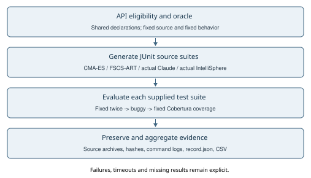
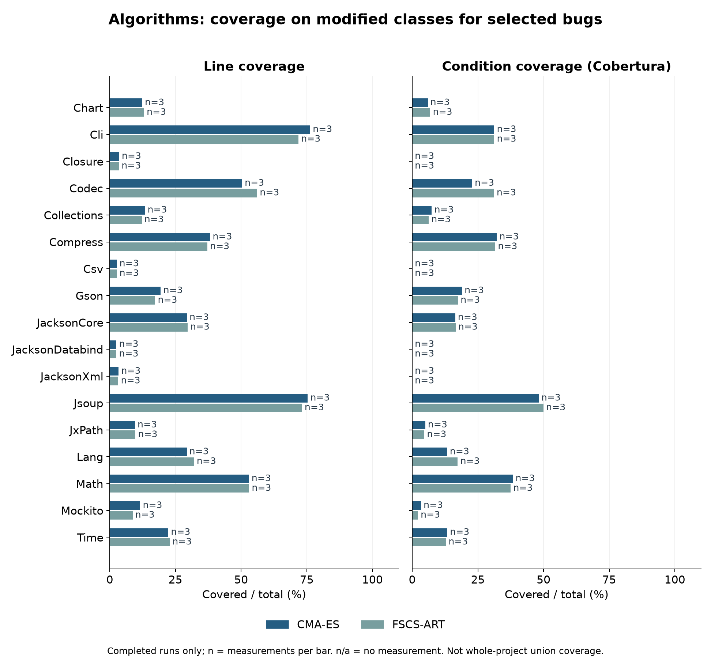
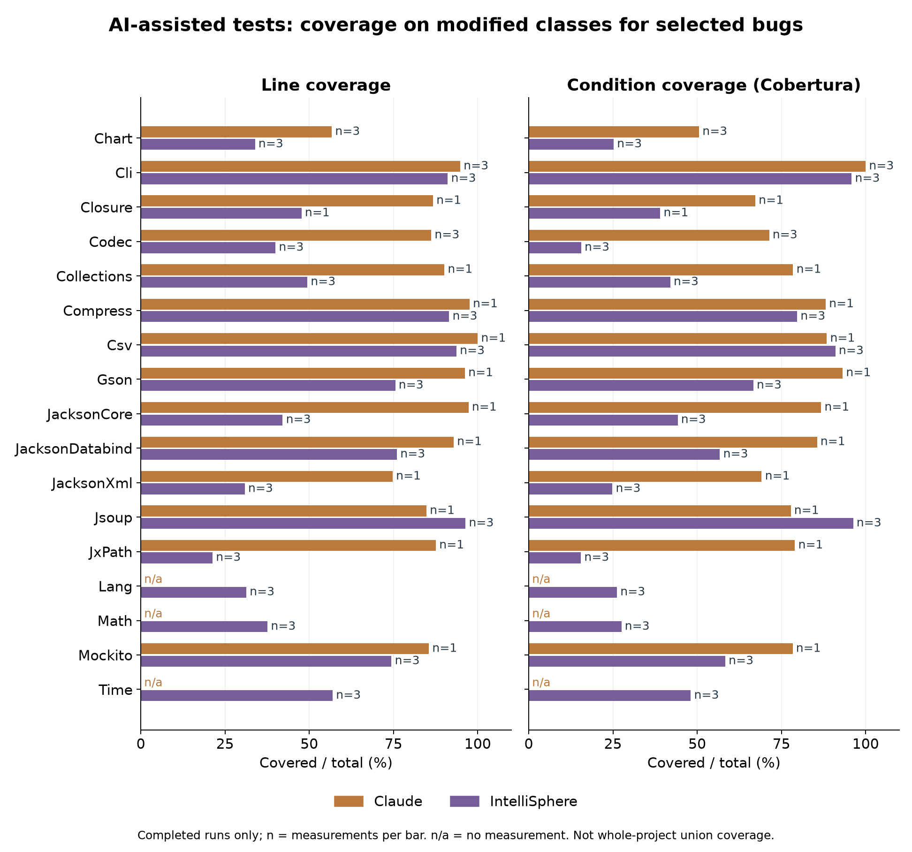

# รายงานผลการทดลองรอบที่ 2

## สถานะของหลักฐาน

รายงานนี้สร้างจากไฟล์ผลจริงเมื่อ 2026-10-01T07:14:41.823904+00:00 เพื่อประกอบงานข้อ 2.2 ของรายวิชา CP353201
สถานะฉบับปัจจุบัน: รายงานระหว่างดำเนินการ ยังยืนยันความครบถ้วนของงานทั้งชุดไม่ได้
พบผลการทดลองในรูปแบบมาตรฐาน 173 run เสร็จสมบูรณ์ 171 run และยังไม่สมบูรณ์หรือข้อมูลไม่ผ่านการตรวจสอบ 2 run

## ผู้จัดทำ

- นายธนินธร อันทรบุตร 673380043-6
- นายศุภกร กรมรินทร์ 673380061-4
- นายณัชพล เพ็งพล 673380267-4
- นายณัฐกรณ์ อินธิสาร 673380268-2

เสนอ ผศ. ดร.ชิตสุธา สุ่มเล็ก มหาวิทยาลัยขอนแก่น ภาคการศึกษาที่ 1 ปีการศึกษา 2569
ชื่อและรหัสนักศึกษาอ้างอิงเอกสารรายงานรอบที่ 1 ที่เก็บไว้ใน docs/reference

## วัตถุประสงค์และคำถามวิจัย

เปรียบเทียบ CMA-ES, FSCS-ART, Claude และ IntelliSphere สำหรับการสร้างชุดทดสอบ Java บน Defects4J โดยใช้ Line coverage, Branch coverage, การตรวจพบบั๊กจริง และต้นทุนการทดลอง
RQ1 แต่ละวิธีครอบคลุมโค้ดได้เท่าใดภายใต้ขอบเขตและงบประมาณเดียวกัน
RQ2 ชุดทดสอบผ่านบน fixed revision และล้มเหลวบน buggy revision หรือไม่
RQ3 การคอมไพล์ เวลา และการปรับพรอมพ์มีข้อจำกัดอย่างไร

## วิธีการและความเป็นธรรม

ปรับ pipeline จากผลตรวจสอบช่วงพัฒนา แล้วบันทึก SHA-256 ของ source/config ก่อนเก็บผล v4 กำหนด Defects4J, project/bug, คลาสเป้าหมาย, seed และงบประมาณไว้ใน manifest เก็บ log และชุดทดสอบจริงสำหรับแต่ละรอบ ไม่อ้างว่าเป็นการลงทะเบียน protocol ล่วงหน้า
การตรวจพบบั๊กต้องมีชุดทดสอบที่คอมไพล์ผ่านและผ่าน fixed revision ก่อนพิจารณาความล้มเหลวบน buggy revision ต้องแยก timeout และความผิดพลาดของ harness ออกจาก fault detection
สำหรับ AI บันทึกผู้ให้บริการและรุ่นโมเดล พรอมพ์ คำตอบดิบ จำนวนรอบแก้ไข เวลาและ token ถ้ามี ใช้บริบทเดียวกันและขอบเขตชุดทดสอบเดียวกัน ไม่ตีความจำนวน prompt เป็นจำนวนการประเมินโปรแกรม
เปรียบเทียบหลักโดยจับคู่ project, bug, seed และ budget ระหว่างวิธี รายงานระดับรวมเป็นเพียงข้อมูลเชิงพรรณนาเมื่อจำนวนตัวอย่างหรือขอบเขตต่างกัน

AI ในชุดนี้เป็น AI-assisted tests ที่ผ่านการประมวลผลในเครื่องตามกติกาที่เปิดเผย: เก็บคำตอบเดิม ตัดจำนวน test methods ตามลำดับ source ให้ไม่เกิน 30 และตัดเฉพาะ methods ที่ไม่ผ่าน fixed validation ได้ไม่เกินสองครั้ง ไม่แก้ expected values จากผล buggy กติกานี้เพิ่มระหว่างการรวมผล AI ไม่ได้ลงทะเบียนล่วงหน้า
Source processing v2/v3 ตัด filename hint บรรทัดแรกในกรอบ Java เฉพาะเมื่อชื่อตรงกับ package/class ที่ประกาศไว้ โดย v3 รองรับคำนำหน้า test source roots ที่ระบุใน policy ไม่ใช่การแก้ assertions; เก็บผล parse failure ก่อนหน้า และ raw source พร้อม before/after hash chain ผลที่สำเร็จอยู่แล้วคงเดิม รายงานรุ่น driver/hash ต่อ record ไว้ครบ กติกานี้เพิ่มหลังพบ ingestion error จึงไม่ได้ลงทะเบียนล่วงหน้า
Source processing v4/v5 เพิ่มการแก้ compatibility ในเครื่องจาก fixed compile diagnostics และ fixed API source เช่นชื่อเมธอดและ nested enum, null overload cast และ assertion แบบ try/catch สำหรับ JUnit รุ่นเก่า เก็บ raw response, ผลก่อนแก้, policy, driver snapshots และ before/after hashes ไม่ส่ง log ให้โมเดลและไม่เปลี่ยน expected values จากผล buggy; JacksonXml 101 เหลือเพียง 1 test หลัง fixed-only pruning จึงตีความ coverage ต่ำตาม suite ที่เหลือจริง
Source processing v6-v29 กู้เฉพาะเมธอด Java ที่สมบูรณ์ก่อนจุดตัดข้อความของ UI, เลือกคลาสชื่อซ้ำตัวแรกตามลำดับคำตอบ, แก้ syntax/import ที่ parser หรือ fixed compiler ระบุ และตัด methods ที่เรียก API ใช้ไม่ได้ พร้อมบันทึก source hashes และผลที่ล้มเหลวก่อนหน้า; v10/v11 ตัดเฉพาะเมธอดที่ fixed compiler ระบุและ cast null เพื่อเลือก overload; v14/v15 ใช้ Option.addValue ตาม fixed API แทน addValueForProcessing ใน Claude Cli โดยไม่เปลี่ยน arguments/assertions; v16-v19 แก้ constructor, XML START_ELEMENT fixture และ configured serializer provider ตาม fixed API; v20-v29 แยก init/parse/normalize/process ของ Closure และใช้ reflection เรียก private method เดิม รวมทั้งแก้ metadata/type/codec/helper ของ Jackson และ Mockito โดยเก็บ assertion เดิม; การแก้ fixture เป็น local AI-assisted processing ที่เปิดเผย มิใช่ output ดิบของโมเดล; count หลัง salvage ไม่ใช่ count ของ test ที่โมเดลตั้งใจเขียนทั้งหมด
Budget 30 หมายถึง proposed input vectors สำหรับอัลกอริทึม และจำนวน JUnit test methods สูงสุดสำหรับ AI หนึ่ง method ของ AI อาจมีหลาย calls/assertions และ stateful fixtures ขณะที่ reflection probe ของอัลกอริทึมสร้าง object graph ได้จำกัด จึงไม่ใช่ input space, จำนวน program calls หรือ compute budget ที่เท่ากันทั้งหมด แม้ใช้ fixed source และ eligible API inventory ร่วมกัน
IntelSphere ใช้ Auto Router และ agent Gemini/OpenAI ที่เลือกเอง ซึ่งเลือกโมเดลได้ต่างกันในแต่ละคำตอบ ผลนี้จึงเป็นการเปรียบเทียบแพลตฟอร์มตามการตั้งค่าที่ใช้ ส่วนข้อความ Java ที่ export จากหน้าเว็บอาจมี suffix (undefined) หลัง array index จึงลบรูปแบบดังกล่าวอย่างจำกัด พร้อมเก็บ HTML และข้อความก่อนแก้ ไม่อ้างว่าเป็น raw API response ที่ตรวจสอบแล้ว
generation_seconds ของ AI รวมเวลาจากกดส่งจนสังเกตว่าคำตอบเสร็จและเวลา processing ในเครื่อง จึงเป็นขอบเขตบนของเวลาที่สังเกตผ่าน UI ซึ่งอาจรวมเวลารอผู้ปฏิบัติงาน ไม่ใช่ model compute time และไม่ใช้จัดอันดับความเร็วกับอัลกอริทึม Token และ model random seed ที่เว็บไม่แสดงเก็บเป็นไม่ทราบ ผู้ใช้อนุญาตเฉพาะ prompt เดิม จึงไม่ได้ส่ง compile/fixed failure logs ไปซ่อมกับโมเดล

## นิยามตัวชี้วัดและตัวหาร

Fault detection rate = จำนวน project/bug ที่ตรวจพบอย่างน้อยหนึ่งรอบ / จำนวน project/bug ที่ประเมินได้ โดยนับแต่ละ bug ครั้งเดียวแม้ทดลองหลาย seed ส่วน fault_detection_run_rate รายงานอัตรารอบที่ตรวจพบแยกต่างหาก
fault_detected เป็นนิยามเชิงปฏิบัติ: assertion ผ่าน fixed สองครั้งและล้มเหลวบน buggy โดยไม่ใช่ harness/timeout error บาง assertion ของ opaque object ตรวจเพียง runtime type จึงอาจผูกกับรายละเอียด implementation การนับนี้ไม่ได้ยืนยันว่าแต่ละ assertion ตรวจ semantic defect ของ public API อย่างเป็นอิสระ ต้องอ่าน triggering test ประกอบ
Compile rate ใช้จำนวน run ที่มีผลการคอมไพล์ชัดเจนเป็นตัวหาร Coverage macro คือค่าเฉลี่ยสัดส่วนต่อ run ส่วน micro คือผลรวม covered / ผลรวม total ของ run ที่วัดได้ ตัวเลข micro มีการนับโค้ดซ้ำเมื่อทดลองหลาย seed จึงไม่ใช่ coverage ของ union ทั้งโครงการ
ค่าที่ไม่วัดใช้ null หรือช่องว่าง ไม่แทนด้วยศูนย์ Coverage ที่ total เป็นศูนย์ไม่รวมในตัวหาร รายงานเวลาของ run ที่เสร็จและวัดได้เท่านั้น

รัน project workers พร้อมกันบน Windows/WSL เครื่องเดียวและใช้ build caches ร่วมกัน เวลาจึงได้รับผลจาก JVM/build overhead, cache warming และ host load ไม่ใช่การวัด CPU ของอัลกอริทึมแบบแยกเครื่อง และไม่ใช้ยืนยันสาเหตุว่าตัวสร้างใดเร็วกว่า

## ผลการทดลองมาตรฐาน

### cmaes

พบ 51 run เสร็จ 51 run คอมไพล์ผ่าน 51/51 run ที่ทราบผล
ตรวจพบ 5/17 bug ที่ประเมินได้ อัตรา 29.41%; ผลระดับ run คือ 9/51
Line coverage macro 26.63% จาก 51 run และ Branch/condition coverage (Cobertura) macro 15.09% จาก 51 run
เวลาเฉลี่ยเฉพาะ run ที่เสร็จ: สร้างชุดทดสอบ 16.16 วินาที; ประเมินชุดทดสอบ 78.11 วินาที; รวม 94.27 วินาที

### fscs-art

พบ 51 run เสร็จ 51 run คอมไพล์ผ่าน 51/51 run ที่ทราบผล
ตรวจพบ 4/17 bug ที่ประเมินได้ อัตรา 23.53%; ผลระดับ run คือ 10/51
Line coverage macro 26.41% จาก 51 run และ Branch/condition coverage (Cobertura) macro 15.63% จาก 51 run
เวลาเฉลี่ยเฉพาะ run ที่เสร็จ: สร้างชุดทดสอบ 15.52 วินาที; ประเมินชุดทดสอบ 82.42 วินาที; รวม 97.94 วินาที

### claude

พบ 20 run เสร็จ 20 run คอมไพล์ผ่าน 20/20 run ที่ทราบผล
ตรวจพบ 8/14 bug ที่ประเมินได้ อัตรา 57.14%; ผลระดับ run คือ 12/20
Line coverage macro 85.32% จาก 20 run และ Branch/condition coverage (Cobertura) macro 77.89% จาก 20 run
เวลาเฉลี่ยเฉพาะ run ที่เสร็จ: สร้างชุดทดสอบ 269.58 วินาที; ประเมินชุดทดสอบ 53.07 วินาที; รวม 322.64 วินาที

### intellisphere

พบ 51 run เสร็จ 49 run คอมไพล์ผ่าน 49/51 run ที่ทราบผล
ตรวจพบ 6/17 bug ที่ประเมินได้ อัตรา 35.29%; ผลระดับ run คือ 14/49
Line coverage macro 58.65% จาก 49 run และ Branch/condition coverage (Cobertura) macro 50.61% จาก 49 run
เวลาเฉลี่ยเฉพาะ run ที่เสร็จ: สร้างชุดทดสอบ 285.77 วินาที; ประเมินชุดทดสอบ 59.14 วินาที; รวม 344.91 วินาที

## หลักฐานและผลล้มเหลวของบริการ AI

จำนวนคำตอบด้านล่างรวม response ที่สร้าง tests ไม่ได้ ส่วน completed หมายถึงผ่าน pipeline ประเมินครบ การมีคำตอบครบ project จึงไม่เท่ากับ coverage ครบทุก project

- claude: บันทึก 20 original-prompt attempts พร้อมคำตอบหรือข้อความสถานะ ครอบคลุม 14/17 projects; ประเมินครบ 20 รอบ; ผลที่ไม่สมบูรณ์ 0 รอบ; โมเดลที่แสดง: Sonnet 5.5, Sonnet 5.5 Medium
- intellisphere: บันทึก 51 original-prompt attempts พร้อมคำตอบหรือข้อความสถานะ ครอบคลุม 17/17 projects; ประเมินครบ 49 รอบ; ผลที่ไม่สมบูรณ์ 2 รอบ; โมเดลที่แสดง: claude-sonnet-5, deepseek-v4-pro, gemini-3.6-flash, gemini-pro, gpt-5.4, qwen3.7-max
- สถานะบริการ claude: quota_exhausted; 20 complete primary runs across 14 projects; 31 missing planned runs. Original Codec s103 response completed before quota notice. Page displays next reset 17:50, inferred 1 October Asia/Bangkok. Lang, Math and Time still need their first direct-Claude response.
- สถานะบริการ intellisphere: 49_complete_2_incomplete_secondary_retry_server_busy; 51 primary requests; 49 completed evaluations covering all 17 projects. Closure s102/s103 remain incomplete. Secondary Gemini attempts returned truncated/prose responses, OpenAI returned no Java, and Deepseek s102 returned server busy. Original prompts only. Last observed quotas: Gemini 67.5%, Deepseek 7.3%, OpenAI 38%; KKU Claude 100%. These are observation snapshots.
ลองซ้ำด้วย prompt เดิมหลัง server busy 2 ครั้ง เก็บข้อความและ record ก่อนหน้าพร้อม hashes ใน results/validation/ai-provider-service-retry เวลา UI ของ service attempts เดิมรายงานแยก ไม่รวมเป็น model compute time หรือ successful-run workflow

คำตอบดิบ ภาพหน้าจอ metadata และ source-processing ledger อยู่ใน ai-tests/provider-captures ผล parser/compile/fixed failures อยู่ใน incomplete-runs.csv และผลซ้ำเดิมอยู่ใน results/validation การล้มเหลวจาก parser หรือ UI export ไม่ถูกสรุปว่าเป็นข้อผิดพลาดของโมเดลเพียงอย่างเดียว
การลอง prompt เดิมผ่าน Gemini และ OpenAI ที่เลือกเองบน KKU วันที่ 1 ตุลาคม เก็บ raw response และผลเดิมใน kku-original-prompt-retries และ original-prompt-retries ไม่นับ retry เป็นรอบอิสระเพิ่ม; Claude Chart s102 รัน archive เดิมซ้ำหลัง OS PermissionError โดยเก็บผลก่อนหน้าใน os-permission-retries และไม่แก้ assertions; รายงานรอบแรกที่ส่งจริงแนบใน docs/reference/SQA_Round1_กลุ่ม14.pdf

ก่อน cohort ที่ใช้ original prompts เท่านั้น มี Claude Csv budget-correction response s101-i2 ที่ยังไม่ผ่าน fixed เก็บไว้เป็นหลักฐานนอก primary cohort ไม่นับแทนรอบ original-prompt และไม่ส่ง compile/fixed failure logs ให้โมเดล

## เปรียบเทียบสี่วิธีบนกลุ่มที่ประเมินครบ

มี 20 กลุ่ม project/bug/run-index/budget ที่ทั้งสี่วิธีประเมินครบ จาก 14 project/bug จึงยังไม่ใช้ค่าเฉลี่ยจากคนละ sample จัดอันดับทั้งสี่วิธี

| วิธี | n | Line macro | Condition macro | ตรวจพบระดับ run |
|---|---:|---:|---:|---:|
| cmaes | 20 | 31.23% | 15.39% | 5/20 |
| fscs-art | 20 | 31.44% | 16.98% | 4/20 |
| claude | 20 | 85.32% | 77.89% | 12/20 |
| intellisphere | 20 | 61.05% | 53.41% | 9/20 |

ใช้เฉพาะกลุ่มเดียวกันในตารางนี้ ตัวอย่างน้อยและเป็นหนึ่ง bug ต่อ project ผลเป็นเชิงพรรณนา ไม่ใช่หลักฐานนัยสำคัญหรือข้อสรุปว่าโมเดลใดดีที่สุด ตัวชี้วัดจาก runs ที่สำเร็จเป็นผลแบบมีเงื่อนไข ต้องอ่านอัตราล้มเหลวประกอบ


## การซ่อมและต้นทุน workflow

ประเมิน archive เดิมซ้ำหลังแก้ dependency 6 run; ตัด assertion จาก fixed validation แล้วประเมินซ้ำ 1 run ผล initial attempts เก็บใน results/validation ไม่ใช่ผลสำเร็จตั้งแต่ครั้งแรก
workflow_seconds รวม generation และการประเมินที่สำเร็จ รวมทั้ง initial failed evaluation และ repackaging เมื่อมี ส่วน total_seconds รวม generation กับ final evaluation เท่านั้น ไม่รวม checkout/setup หรือเวลาพัฒนา

- cmaes: workflow เฉลี่ย 95.10 วินาที จาก 51 run
- fscs-art: workflow เฉลี่ย 98.56 วินาที จาก 51 run
- claude: workflow เฉลี่ย 328.92 วินาที จาก 20 run
- intellisphere: workflow เฉลี่ย 355.51 วินาที จาก 49 run

## แผนภาพขั้นตอนการทดลอง



ตรวจเฉพาะ declaration signatures เพื่อกำหนด API ที่มีทั้งสอง revision ส่วนการสร้างอินพุตและ expected outcomes ใช้ fixed revision ผลล้มเหลวและ timeout คงอยู่ในหลักฐาน

## Coverage รายโปรเจกต์



กราฟใช้ค่าเฉลี่ยของ run ที่เสร็จ โดย n คือจำนวน observations ต่อแถบ ช่อง n/a ยังไม่มีผลที่วัดได้

### Coverage ของ AI-assisted tests



กราฟ AI ใช้เฉพาะ runs ที่ประเมินครบ ไม่รวมคำตอบที่ parse/compile/fixed validation ไม่ผ่าน Sample และจำนวนรอบต่อ project อาจต่างจากอัลกอริทึม อ่านอัตราล้มเหลวและตาราง matched comparison ประกอบ

## เปรียบเทียบอัลกอริทึมบนคู่ทดลองเดียวกัน

จับคู่ได้ 51 คู่ จาก 17 project/bug โดยใช้ seed และ budget ตรงกัน
- line: ค่าเฉลี่ย CMA-ES ลบ FSCS-ART = +0.22 percentage points จาก 51 คู่
- branch: ค่าเฉลี่ย CMA-ES ลบ FSCS-ART = -0.54 percentage points จาก 51 คู่
- total_seconds: ค่าเฉลี่ย CMA-ES ลบ FSCS-ART = -3.67 วินาที จาก 51 คู่
- workflow_seconds: ค่าเฉลี่ย CMA-ES ลบ FSCS-ART = -3.45 วินาที จาก 51 คู่
ผลนี้เป็นสถิติเชิงพรรณนาของ sample ปัจจุบัน seed หลายตัวของ bug เดียวกันไม่ใช่ bug อิสระ และไม่มีการอ้างนัยสำคัญทางสถิติ

## Project/bug ที่มีหลักฐานตรวจพบ fault

- Chart-1: claude, intellisphere
- Cli-1: claude, cmaes, fscs-art, intellisphere
- Closure-1: claude
- Compress-1: cmaes, fscs-art
- Csv-1: claude, intellisphere
- Gson-1: claude, intellisphere
- JacksonCore-1: claude, cmaes, fscs-art
- JacksonDatabind-1: claude, intellisphere
- JxPath-1: claude
- Math-1: cmaes, fscs-art
- Mockito-1: intellisphere
- Time-1: cmaes
รายการนี้ต้องมี fixed ผ่านสองครั้งและ buggy failure ของ assertion ที่ประเมินได้ อ้างอิง triggering_tests และ buggy/failing_tests ของแต่ละ record ไม่ใช้ผลจาก harness error

## สถานะรายโปรเจกต์

จำนวน run ที่เสร็จเทียบกับจำนวนที่วางแผนใน manifest (แสดงเป็น เสร็จ/ตามแผน); ค่า 0 หมายถึงยังไม่มี run เสร็จ ไม่ได้แปลว่าทดลองแล้วได้ศูนย์ coverage

| Project | Bug | CMA-ES | FSCS-ART | Claude | IntelliSphere |
|---|---:|---:|---:|---:|---:|
| Chart | 1 | 3/3 | 3/3 | 3/3 | 3/3 |
| Cli | 1 | 3/3 | 3/3 | 3/3 | 3/3 |
| Closure | 1 | 3/3 | 3/3 | 1/3 | 1/3 |
| Codec | 1 | 3/3 | 3/3 | 3/3 | 3/3 |
| Collections | 1 | 3/3 | 3/3 | 1/3 | 3/3 |
| Compress | 1 | 3/3 | 3/3 | 1/3 | 3/3 |
| Csv | 1 | 3/3 | 3/3 | 1/3 | 3/3 |
| Gson | 1 | 3/3 | 3/3 | 1/3 | 3/3 |
| JacksonCore | 1 | 3/3 | 3/3 | 1/3 | 3/3 |
| JacksonDatabind | 1 | 3/3 | 3/3 | 1/3 | 3/3 |
| JacksonXml | 1 | 3/3 | 3/3 | 1/3 | 3/3 |
| Jsoup | 1 | 3/3 | 3/3 | 1/3 | 3/3 |
| JxPath | 1 | 3/3 | 3/3 | 1/3 | 3/3 |
| Lang | 1 | 3/3 | 3/3 | 0/3 | 3/3 |
| Math | 1 | 3/3 | 3/3 | 0/3 | 3/3 |
| Mockito | 1 | 3/3 | 3/3 | 1/3 | 3/3 |
| Time | 1 | 3/3 | 3/3 | 0/3 | 3/3 |

## หลักฐาน pilot เดิม Lang 1

หลักฐานส่วนนี้มาจาก differential-v3 แยกจากการทดลองมาตรฐาน เพื่อไม่ให้จำนวนอินพุตที่ให้พฤติกรรมต่างกันถูกนับเป็นจำนวนบั๊กอิสระ

- cmaes: 30 อินพุต พบความแตกต่างไม่ซ้ำ 15 รายการ สร้าง JUnit 15 test; fixed ผ่าน=True, buggy ล้มเหลว=True. หลักฐาน: results/raw/Lang/1/differential-v3/20260919T200905Z/cmaes-seed2026-b30/summary.json
- fscs-art: 30 อินพุต พบความแตกต่างไม่ซ้ำ 21 รายการ สร้าง JUnit 21 test; fixed ผ่าน=True, buggy ล้มเหลว=True. หลักฐาน: results/raw/Lang/1/differential-v3/20260919T200905Z/fscs-art-seed2026-b30/summary.json

หลักฐาน pilot ใช้เพียง Lang-1, seed 2026 และ budget 30 จึงแสดงการทำงานของ pipeline ในกรณีนี้เท่านั้น จำนวนความแตกต่างไม่ซ้ำไม่ใช่อัตราตรวจพบบั๊กทั่ว Defects4J และไม่ใช่ coverage

## ความครบถ้วนและข้อผิดพลาด

manifest ระบุ 204 run ไม่พบ record 31 run และพบ run ที่ยังไม่สมบูรณ์ 2 run
พบปัญหาข้อมูล 0 รายการ โปรดดู issues.csv และ incomplete-runs.csv

## อภิปรายผลและข้อจำกัด

ผลจาก sample ที่ต่างกันหรือเพียง seed เดียวไม่เพียงพอต่อการจัดอันดับทั้งสี่วิธี ต้องรายงานผลต่อ project และต่อ bug คู่กัน รวมทั้งผลล้มเหลวและเวลา timeout
CMA-ES ขึ้นกับ input representation และ fitness ที่ใช้ ส่วน FSCS-ART ขึ้นกับระยะห่างและขอบเขตอินพุต ความแตกต่างระหว่างวิธีจึงต้องวิเคราะห์ร่วมกับ configuration จริง การอ้างว่าตัวสร้างทดสอบทั่วไปครอบคลุมทุก API ต้องมีหลักฐานรองรับ
Claude และ IntelliSphere ต้องมีคำตอบจริงจากบริการดังกล่าวและบันทึกรุ่นโมเดลก่อนเปรียบเทียบ ผลที่สร้างโดยเครื่องมืออื่นไม่สามารถใช้แทนผลของสองบริการนี้ได้
ยังไม่สรุปว่าวิธีใดดีที่สุด เพราะผลที่จับคู่ครบทั้งสี่วิธียังเป็นเพียงบางส่วนของแผนทดลอง การประเมินครบทุก project identity ใช้หนึ่ง active bug ต่อโปรเจกต์ จึงต้องจำกัดข้อสรุปให้อยู่ใน sample นี้

## สิ่งที่ต้องเสร็จก่อนส่ง

- ตรวจจำนวน algorithm runs กับ manifest และอธิบายการเลือกหนึ่ง bug ต่อ project รวมถึงขอบเขต API
- เก็บชุดทดสอบจริง พรอมพ์และคำตอบของ Claude กับ IntelliSphere พร้อมผลรัน
- ประเมินชุด AI ด้วย evaluator และขอบเขต coverage เดียวกับอัลกอริทึม เพื่อให้การเปรียบเทียบครบสี่วิธี
- สร้างรายงานและสไลด์ใหม่หลังเพิ่มผล AI ตรวจ submission checklist ส่ง GitHub/Classroom และซ้อมนำเสนอ demo

## แหล่งข้อมูลและการทำซ้ำ

- เกณฑ์งาน: docs/reference/SQA_Project_2026.pdf ข้อ 2.2
- ข้อมูลผู้จัดทำและแนวทางรอบแรก: docs/reference/SQA_Round1_กลุ่ม14.pdf
- ผลมาตรฐาน: results/study/**/record.json และ artifact_path ในแต่ละ record
- ผล pilot: results/raw/Lang/1/differential-v3/20260919T200905Z
- รายละเอียดตัวหารและคำสั่งสร้างใหม่: docs/reporting.md

## เอกสารอ้างอิงแนวคิด

- Hansen (2016), The CMA Evolution Strategy: A Tutorial. https://arxiv.org/abs/1604.00772
- Chen, Leung and Mak (2004), Adaptive Random Testing. https://link.springer.com/chapter/10.1007/978-3-540-30502-6_23
- Defects4J release 3.0.1 และ framework documentation. https://github.com/rjust/defects4j/tree/v3.0.1
อ้างอิงแนวคิดของอัลกอริทึม ส่วน implementation, representation, fixed-outcome fitness และตัวเลขของโครงการนี้ต้องอ่านจาก source/config/หลักฐานที่แนบ ไม่ใช้ผลประสิทธิภาพจากงานวิจัยอื่นแทนผลทดลองของโครงการ

## อุปสรรคและบทเรียนจากหลักฐานจริง

การทดลอง v3 พบ target ที่มีเฉพาะ fixed revision และ assertion ของ char array ที่ยาวเกิน Java constant limit จึงปรับ v4 ให้ใช้ signature intersection และ snapshot SHA-256 ผล v3 เก็บใน results/validation ไม่รวมในสถิติ v4
Cli พบ NoClassDefFoundError ของ Hamcrest ก่อนเริ่ม test จึงปรับ framework dependency ให้ใช้ JUnit/Hamcrest jar ที่ Defects4J มีอยู่ และประเมิน archive เดิมซ้ำ เก็บ log เดิมและ before/after configuration ไว้ ไม่เปลี่ยน production code หรือ assertion
Coverage ต่ำหรือไม่ตรวจพบ fault ยังเป็นผลที่รายงานได้ ตัวสร้างที่ใช้ reflection แบบ single call และ opaque object oracle มีขอบเขตจำกัด รายละเอียดและเส้นทาง log อยู่ใน docs/lessons-learned.md

บาง expected values โดยเฉพาะ hashCode ที่ขึ้นกับ object identity ให้ผลซ้ำกันใน observation JVM แต่เปลี่ยนใน JUnit จึงใช้ follow-up fixed-validation-pruning-v1 ตัดเฉพาะ generated methods ที่ล้มเหลวบน fixed revision แล้วรัน fixed สองครั้ง/buggy/coverage ใหม่ ไม่ใช้ buggy outcome เลือก test และไม่สร้าง input เพิ่ม จำนวน final tests อาจต่ำกว่า budget 30 ที่นับ proposed inputs

- cmaes: 1530 proposed inputs, 1529 final tests, 828 assertions ของ exception class และ 701 ของผลค่า/ชนิด/nullness จาก 51 runs
- fscs-art: 1530 proposed inputs, 1529 final tests, 833 assertions ของ exception class และ 696 ของผลค่า/ชนิด/nullness จาก 51 runs
Exception oracle ยืนยันเพียงชนิด exception และ opaque object oracle ไม่ยืนยัน state ภายใน การใช้ null/constructor fixtures จึงอาจให้ assertions จำนวนมากแต่สำรวจพฤติกรรมไม่ลึก ต้องพิจารณา coverage กับการตรวจพบ fault ร่วมกัน

## ภาคผนวก ก Configuration ที่ใช้จริง

ต้นทาง results/study/round2-v4-20260929/config.json รวม source SHA-256 ในไฟล์เต็ม

```json
{
  "study": "prospective-shared-api-fixed-reference-v2",
  "defects4j_version": "3.0.1",
  "timezone": "America/Los_Angeles",
  "generators": [
    "cmaes",
    "fscs-art",
    "claude",
    "intellisphere"
  ],
  "seeds": [
    101,
    102,
    103
  ],
  "budgets": [
    30
  ],
  "selection": "lowest active bug ID per project; unsupported targets retained as blocked",
  "scope_limit": "one active bug per project, not every active bug; no instructor approval inferred",
  "input_domain": "declared methods, scalar/array inputs, bounded recursive fixtures, null boundaries and concrete subclasses for abstract targets",
  "cmaes_fitness": "fixed outcome frequency minimization; no buggy observations or patch feedback",
  "coverage_scope": "all classes modified by the selected fix",
  "api_eligibility": "intersection of fixed and buggy declaration signatures, with common fixture class names; no buggy behavior used in generation",
  "long_observations": "SHA-256 and UTF-8 byte length for exact serialized outcomes longer than 16000 characters",
  "command_timeout_seconds": 900,
  "observation_timeout_seconds": 10
}
```

สภาพแวดล้อมที่บันทึกจริง (ไม่รวมชื่อเครื่อง/ข้อมูลล็อกอิน)

```json
{
  "captured_at_utc": "2026-09-28T20:06:00.266361+00:00",
  "os_release": "6.18.33.2-microsoft-standard-WSL2",
  "python_version": "3.12.3",
  "cpu_model": "AMD Ryzen 7 5700U with Radeon Graphics",
  "logical_cpus": 16,
  "wsl_memory_kib": 11902616,
  "execution": "Windows host / WSL Ubuntu; disjoint project/run workers, shared host load and build caches; setup excluded from run timing"
}
```

## ภาคผนวก ข ตัวอย่าง test และผลรันจริง

source: results/study/round2-v4-20260929/Cli/cmaes-s101-b30/generation/GeneratedStudyTest.java
record: results/study/round2-v4-20260929/Cli/cmaes-s101-b30/evaluation/record.json

```java
  @Test(timeout=10000)
  public void generated2() {
    assertEquals("value:object-type:java.util.HashMap$KeyIterator", SqaProbe.observe("org.apache.commons.cli.CommandLine", "", "iterator", "", new double[]{-0.22083770669199668, 0.89450074379313704, 0.37411400333875733}));
  }
```

```json
{
  "run_id": "round2-v4-20260929/Cli/cmaes-s101-b30",
  "test_count": 30,
  "compile_status": "passed",
  "fixed_validation": "passed_twice",
  "fault_detected": true,
  "triggering_tests": [
    "GeneratedStudyTest::generated2",
    "GeneratedStudyTest::generated5",
    "GeneratedStudyTest::generated14",
    "GeneratedStudyTest::generated21"
  ],
  "line_covered": 33,
  "line_total": 45,
  "branch_covered": 5,
  "branch_total": 16,
  "generation_seconds": 9.757088117999956,
  "duration_seconds": 57.097900364,
  "total_seconds": 66.85498848199995
}
```

## ภาคผนวก ค Prompt กลางของเครื่องมือ AI

ต้นทาง prompts/round2-unit-test.md แต่ละ project เพิ่ม source, build configuration และ target inventory ใน ai-context/prompt.md การมี prompt ยังไม่ใช่หลักฐานว่าใช้บริการ AI แล้ว

```text
# Defects4J unit test generation

You are a Java unit testing engineer. Write deterministic regression tests for the
production classes supplied below, using their documented and fixed-reference
behavior. This experiment measures test generation from fixed production source.

Produce Java test sources with assertions. Exercise normal cases, boundaries,
invalid inputs, exception paths and branches supported by the supplied source.
Inspect the supplied build configuration and use the JUnit version and dependencies
already available to this project. Defects4J projects can have different build
systems and JUnit versions; do not assume Maven or JUnit 5. Use Java 11 compatible
syntax unless the build configuration requires an older source level.

Constraints:

- Do not change production code or build files and do not add dependencies.
- Use the reference behavior to derive assertions; do not invent unsupported APIs.
- Avoid network access, external programs, wall-clock timing, random values without
  a fixed seed, machine-specific paths and environment-dependent assertions.
- Use test class names ending in `Test`, correctly matching Java file and package
  names. Place each source at its package-relative path, such as
  `org/example/GeneratedExampleTest.java`.
- Keep tests independent. Restore global state that a test changes.
- Do not ask for a bug patch, buggy revision, existing detecting test, or hidden
  evaluation results. Only the supplied reference source and build information may
  guide the initial generation.

Return each Java file in a separate fenced Java code block, preceded by its
package-relative path. Include complete imports and test class definitions. If the
context is insufficient to write a compiling test, explicitly state the missing
API or dependency rather than producing a fabricated result.
```

## จำนวน test cases และหน่วยการนับ

นับ declared test methods ที่คงเหลือในชุด primary ซึ่งประเมินสำเร็จเท่านั้น รวมหลายโปรเจกต์และหลาย run indices; กรณีซ้ำข้ามรอบนับซ้ำ ไม่ใช่จำนวน semantic scenarios ที่ไม่ซ้ำ และไม่คูณจำนวนครั้งที่รัน fixed/buggy; ไม่รวม pilot หรือ repair histories

- cmaes: 1,529 methods ใน 51 completed runs
- fscs-art: 1,529 methods ใน 51 completed runs
- claude: 581 methods ใน 20 completed runs
- intellisphere: 1,072 methods ใน 49 completed runs

จำนวน methods ของชุดที่ยังไม่สมบูรณ์แยกไว้ใน test-case-counts.csv และไม่อ้างว่าเป็น tests ที่ใช้วัดผลสำเร็จแล้ว
